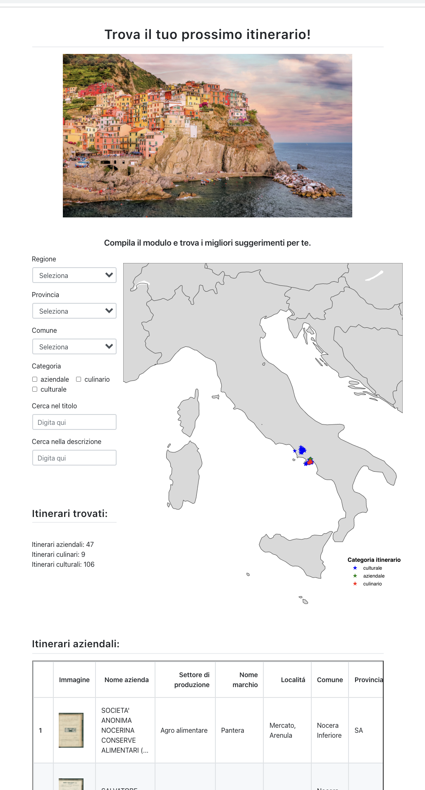
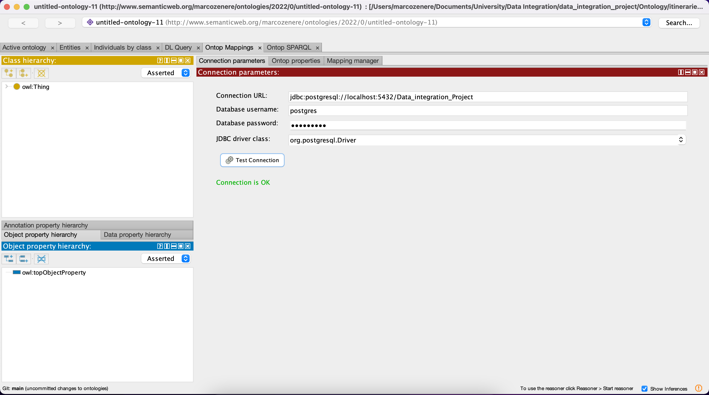

# Data Integration Project - Itineraries Dataset

## Authors
Marco Zenere 
Marco Di Panfilo

Free University of Bozen-Bolzano - Academic year 2021/2022

# Motivation

Cultural heritage is a resource with a strategic value for each country’s social and economic develop-
ment, particularly for Italy, famous for having one of the largest heritage in the world. Considering
the continent we live in, the European Union supports the protection and the promotion of the
cultural heritage of the state members. In recent years, several projects were born for supporting
the European initiatives, and HETOR 1 is one of them, focused on the heritage in the Campania
region. HETOR project aims to exploit the Open Data power to reveal the Campania cultural
heritage and rekindle people’s interest in the ’old things’ in Campania.

# Data

The HETOR project includes several domains of the Campania heritage, each composed of multiple
datasets. For the Data Integration project, our group focused on the itineraries domain that is
composed of the following four datasets:

- Itineraries - Caserta [CSV]
- Itineraries - Nocera Inferiore [CSV]
- Itineraries - Nocera [CSV]
- Itineraries - Costiera Amalfitana [CSV]

Each of the files includes a lot of information about itineraries, such as geographical co-
ordinates, type of itinerary, bibliography, and sitography. Still, it is important to mention the
inconsistency of the information among the files. Some information in one file may be missing in
another, even though the files refer to the same domain. Sometimes cannot be possible to extract
the same type of information for each type of itinerary in the datasets (cultural, company, culi-
nary). The list of the attributes of each dataset, together with the datasets themselves, can be
found in the HETOR project’s shared folder

# Application

We created a web-application with a input form where the user can set filters. The application will show
the filtered itineraries on a map and in a table. The application querries the data through SPARQL queries
on an Ontop endpoint that is connected to a PostgreSQL. The application was created wit the [https://www.pyweb.io](https://www.pyweb.io) library.

The following image shows a screenshot of the web-application, showing the filters on the left the map on the right and the tables on the bottom:

# Folder structure

- **`environment.yml:`** the file contains the libraries and versions used to create the python kernel to run the notebooks.
- **`Dataset:`** contains the original datasets.
- **`Dataset_cleaning:`** contains the notebooks that were used to clean the datasets. 
- **`Dataset_clean:`** contains the cleaned version of the datasets.
- **`Database:`** contains the dump file of the database and the notebooks to load the cleaned datasets into the database.
- **`JDBC_PostgreSQL_Driver:`** contains the drivers used by Protege to access the database.
- **`Ontology:`** contains the files that describe the Ontology used with ontop and Protege.
- **`Application:`** contains the files to run the web-application.

# How to run the project

## 1. Create Python Kernel

First install Anaconda, by following instructions at [https://docs.anaconda.com/anaconda/install/](https://docs.anaconda.com/anaconda/install/).

To run the code you have to create an *`anaconda`* environment with the configuration file *`environment.yml`* (step 1) and then activate it (step 2) to run the code.

            1. conda env create -f environment.yml
            2. conda activate data_integration_project
            3. jupyter notebook
            4. conda deactivate
            5. conda env remove --name data_integration_project

To run the jupyter-notebooks you have to run the code cells in the file *`ipynb-files`* after step 3. After closing the notebook the conda environment can be deactivated (step 4) and/or removed (step 5).

## 2. Data cleaning

For each dataset a separat notebook has been created in the Dataset_cleaning folder. The notebooks follow the proposed cleaning steps that can be found in *`HETOR_dataset_correction_proposals.pdf`*. 
*`data_cleaning_util.py`* contains the methods to clean the data that are shared amongst all data cleaning notebooks. The cleaned datasets are saved in Dataset_clean as csv and pickle.

## 3. Import datasets to PostgreSQL database

If PostgreSQL and pgAdmin are not yet installed they can be downloaded at [https://www.postgresql.org/download/ ](https://www.postgresql.org/download/) and installed.

There are 2 options to import the data into PostgreSQL database:
1. Run *`Create_database.ipynb`*. In order to access the database from the jupyter notebook it is necessary to set the configurations for the database connection in the *`database_configuration.txt`* file. 
We provide a template in *`database_configuration_template.txt`* with default values except for the password. After the configurations have been set in the template you should rename it to 
*`database_configuration.txt`*. The code in the notebook replaces or creates a new schema named 'public' and extracts the data from the cleaned csv files to the database tables.
2. Restore the PostgreSQL dump saved in *`Data_Integration_Database.sql`*. Create a new database with pgAdmin and restore the database by right clicking the database, selecting Restore, entering the 
file path of the dump file and press on Restore.

## 4. Create Ontology on top of PostgresSQL database

We used Protégé 5.5.0 ([https://protege.stanford.edu](https://protege.stanford.edu)) with Ontop-Plugins 4.2.0 to creata the Ontology. In order to connect Protege to the database it is necessary to
add the driver and set the parameters for the databse. To add the driver go to Protege->Preferences->JDBC Driver->Add. Select *`org.postgresql.Driver`* for the Class Name and add the Path to the 
driver that is storde in the folder *`JDBC_PostgreSQL_Driver`*. The parameters for the database connections can be set in Ontop Mappings Tab. Go to sub tab *`Connection parameters`* and set the 
parameters like in *`Connection_Parameters_Protégé.png`*. 

In alternative you can set the paramaters in the *`itineraries_ontology_template.properties`* files and rename it to 
*`itineraries_ontology.properties`*.

To access the Ontology and run querris on it we installed Ontop CLI 4.2.0 following the steps described in 
[https://ontop-vkg.org/tutorial/endpoint/endpoint-cli.html](https://ontop-vkg.org/tutorial/endpoint/endpoint-cli.html). After a successfull start Ontop endpoint will be running at 
[http://localhost:8080/sparql](http://localhost:8080/sparql).

In our case we created a folder input within the Ontop CLI folder and copied the following files from the Ontology folder:

- itineraries_ontology.owl
- itineraries_ontology.obda
- itineraries_ontology.properties

After that we copied the database driver *`postgresql-42.3.1.jar`* from the folder *`JDBC_PostgreSQL_Driver`* to the folder *`jdbc`* of the Ontop CLI folder.

Finally we can open a shell in the main folder of Ontop CLI and run the Ontop CLI with the following command:

            ./ontop endpoint \
            --ontology=input/itineraries_ontology.owl \
            --mapping=input/itineraries_ontology.obda \
            --properties=input/itineraries_ontology.properties

## 5. Run the web appplication

We developed a web-application that allows the user to search for itineraries. 

The application can be started from the command line. In a terminal shell go to the folder Application and activate the
environment with:
                
            conda activate data_integration_project
                
Now you are ready to start the appication with the comand

            python3 application.py [-h] [-r REMOTE_ACCESS] [-p PORT] [-d DEBUG] [-a AUTO_OPEN_WEBBROWSER]

By default the arguments are set to --remote_access False, --port 8080, --debug False, and auto_open_webbrowser True. When setting --remote_access to True you will get a
public, shareable address for the current application. Others can access your application in their browser via this address. Because the processing happens on your device the app will be running as 
long as your device stays on.

After running the comand the web-browser should open the web-application or you can access it on the address provided in the shell.